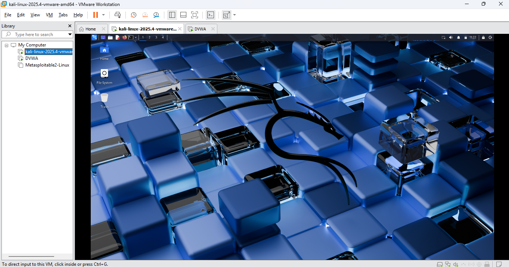
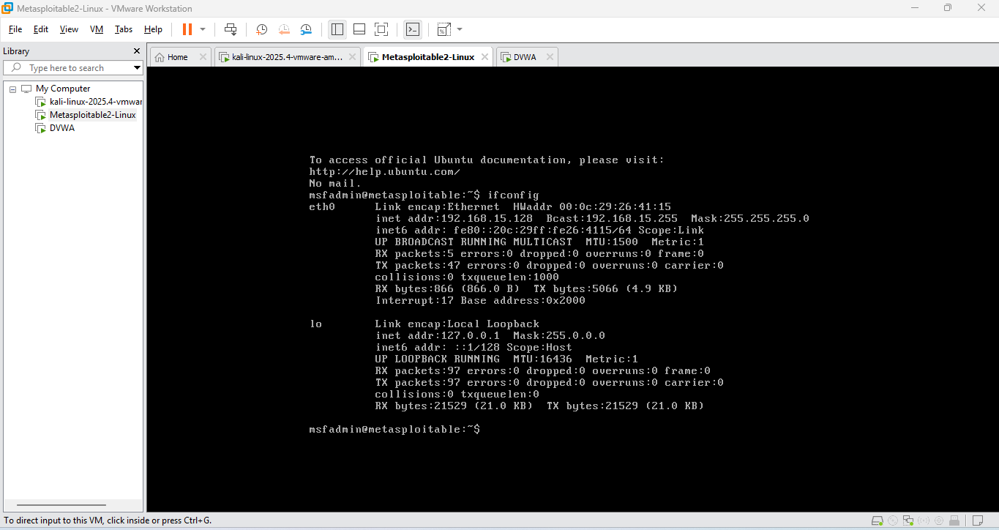

# Lab Setup Report – Task 1  
Cybersecurity & Ethical Hacking Internship  
ApexPlanet Software Pvt. Ltd.

---

## Objective
To set up an isolated cybersecurity lab environment consisting of:
- Kali Linux (Attacker Machine)
- Metasploitable2 & DVWA (Vulnerable Targets)
- Host-Only network for safe penetration testing

---

## 1️⃣ Kali Linux – Attacker Machine

### Kali Desktop Screenshot

✔ Kali successfully installed & running inside VMware

---

## 2️⃣ Metasploitable2 – Target Machine

### Login Screen

### Network Configuration (IP Address)

✔ Target IP identified for attack testing

---

## 3️⃣ DVWA – Web Vulnerable Target

### DVWA Login Page (Accessed from Kali Browser)

### DVWA Network Configuration

✔ DVWA reachable inside isolated network

---

## 4️⃣ Network Connectivity Test

### Kali → Metasploitable Ping Test

✔ Successful communication  
✔ Confirms both machines are connected properly

---

## 5️⃣ Wireshark Packet Capture

### Network Traffic Sniffing

✔ Able to inspect packets including DNS/TCP/ICMP  
✔ Confirms monitoring capability from attacker system

---

## Network Mode Used
| Setting | Status |
|--------|--------|
| Host-Only Adapter | ✔ Enabled |
| Internet Access | ❌ Blocked (Secure Lab) |
| Same Network Subnet | ✔ Yes |

---

## Tools Installed & Verified
| Tool | Purpose | Status |
|------|---------|--------|
| Kali Linux | Attacker System | ✔ |
| Metasploitable2 | Vulnerable Target | ✔ |
| DVWA | Web Vulnerability Training | ✔ |
| Wireshark | Packet Analyzer | ✔ |
| Nmap | Network Scanner | ✔ |
| Netcat | Debugging | ✔ |

---

## 🎯 Final Outcome
| Requirement | Completed |
|------------|-----------|
| Virtual Lab Setup | ✔ |
| Private Network Configuration | ✔ |
| Screenshots & Report | ✔ |
| Tools Familiarization | ✔ |

> Lab setup successfully completed and ready for **Task-2: Network Security & Scanning**.

---

### Submitted By: Agam Sharma
**Task-1: Foundation & Environment Setup**  
Cybersecurity Internship – ApexPlanet Software Pvt. Ltd.
