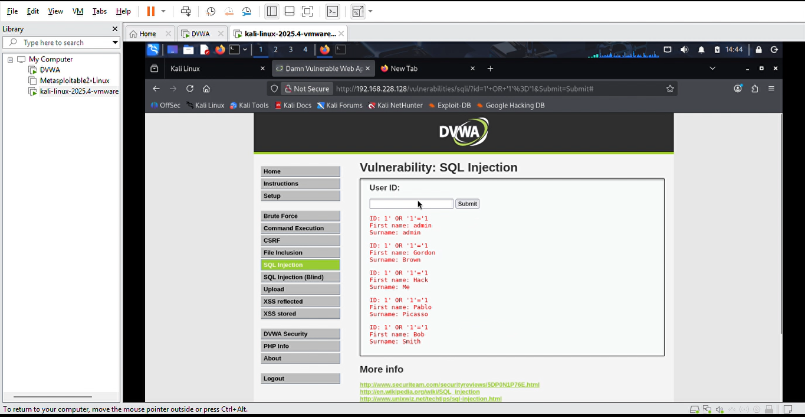
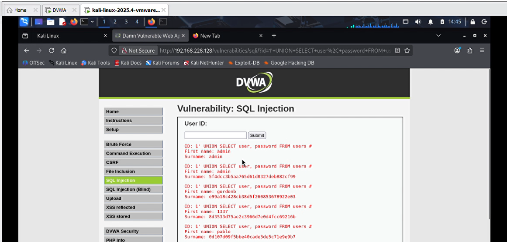
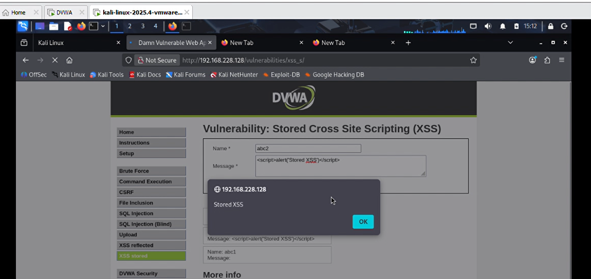
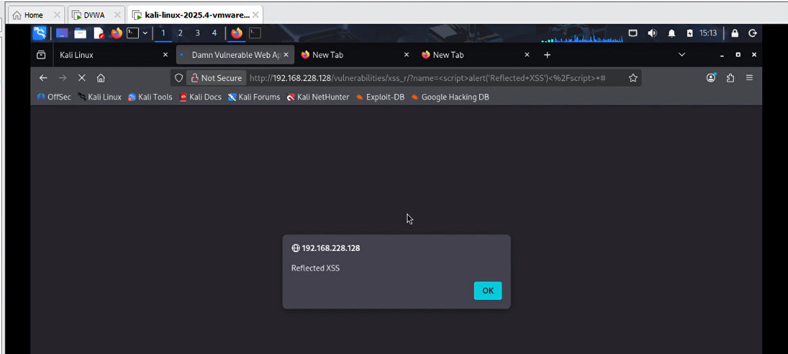
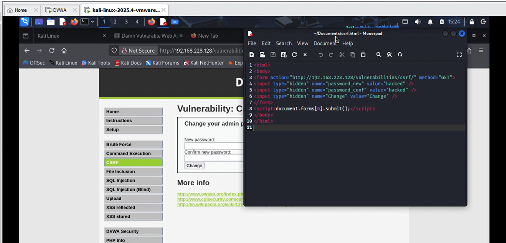
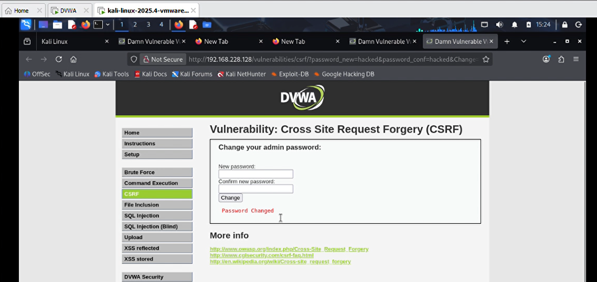

# Security Testing Report  
## Task – 3: Web Application Security

This report documents the security testing performed on a deliberately
vulnerable web application (DVWA) in a controlled lab environment. The objective
was to identify, exploit, and analyze common OWASP Top 10 vulnerabilities and
observe their security impact.

---

## Test Environment
- Operating System: Kali Linux
- Target Application: Damn Vulnerable Web Application (DVWA)
- Security Level: Low
- Testing Tools: Web Browser, Burp Suite
- Testing Type: Manual security testing

---

## 1. SQL Injection (SQLi)

### Test Description
SQL Injection testing was performed by injecting malicious SQL payloads into
user input fields that interact with the backend database.

### Payload Used
```
1' UNION SELECT user, password FROM users#
```
### Test Result
- The application returned multiple database records.
- Usernames and password hashes were successfully extracted.

### Risk Level
**High**

### Security Impact
- Disclosure of sensitive user credentials
- Authentication bypass
- Potential full database compromise

### Evidence

- Screenshot: `screenshots/sqli-attack.png`

- Screenshot: `screenshots/sqli-data-extraction.png`

---

## 2. Cross-Site Scripting (XSS)

### 2.1 Stored XSS

#### Test Description
Malicious JavaScript code was submitted through an input form and stored in the
application database without validation.

#### Payload Used
```html
<script>alert('Stored XSS')</script>
```
### Test Result
- The script was executed whenever the affected page was accessed.
- The alert was triggered for all users viewing the page.

### Risk Level
**High**

### Evidence

- Screenshot: `screenshots/xss-stored.png`

---

## 2.2 Reflected XSS

### Test Description
JavaScript payloads were injected via URL parameters and reflected in the HTTP
response.

### Payload Used
```html
<script>alert('Reflected XSS')</script>
```
### Test Result
- The script executed immediately in the victim’s browser.

### Risk Level
**Medium**

### Evidence

- Screenshot: `screenshots/xss-reflected.png`

---

## 3. Cross-Site Request Forgery (CSRF)

### Test Description
A forged HTTP request was created to perform a password change operation for a
logged-in user without their consent.

### Attack Method
- A malicious HTML form was used to send an authenticated request to the
  application.

### Test Result
- The victim’s password was changed successfully without user interaction.

### Risk Level
**High**

### Security Impact
- Unauthorized account modification
- Loss of account integrity

### Evidence

- Screenshot: `screenshots/csrf-attack.png`

- Screenshot: `screenshots/csrf-password-changed.png`

---

## Summary of Findings

| Vulnerability     | Risk Level |
|-------------------|------------|
| SQL Injection     | High       |
| Stored XSS        | High       |
| Reflected XSS     | Medium     |
| CSRF              | High       |

---

## Conclusion
The security testing revealed multiple critical vulnerabilities in the target
web application. These vulnerabilities demonstrate how improper input handling,
lack of request validation, and insecure design choices can lead to serious
security risks. Implementing secure coding practices and appropriate mitigation
techniques is essential to protect web applications from exploitation.

